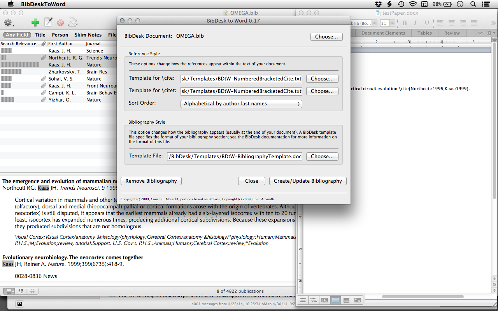
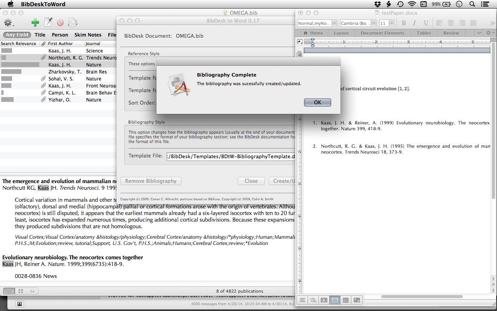

# BibDeskToWord

MS Word bibliography management using [BibDesk](http://bibdesk.sourceforge.net). Works with Word 2008 and 2011.





## Installation

There are a couple ways to install including running as a python script or building a local OS X application bundle. All of which are documented in [ReadMe.html](ReadMe.html). The binary app is no longer available through the original host.

### Building as an app
This version tested successfully with Office 2011 (v14.1.4) and BibDesk 1.6.2.

* Successful compilation of v0.17 source on Mac OS 10.9.2 using: 
	* python 2.7.4
	* Clang: 5.1 build 503 from Xcode cmd line tools. 
	* wxPython 3.0.0.0
	* py2app 0.8
	* appscript 1.0.1

Steps: 

* install gcc (just install XCode)
	* Need to install command line tools within XCode --> Preferences-->Downloads
* install Homebrew
	* This gets you homebrew with git so you can use the general purpose mac os x package installer.
		```bash
		ruby -e "$(curl -fsSL https://raw.github.com/mxcl/homebrew/go)"
		brew doctor
		```
* install python 

		brew install python
	
* Install pip (a pkg management installer/uninstaller)

		easy_install pip

* Install virtualenv for creating virtual Python environments for application development

		pip install virtualenv

* Install wxpython, py2app, and appscript required for building the BibDeskToWord application:  

		brew install --env=std wxpython  	
		pip install py2app
		pip install appscript  


## Contributions 

Original by Conan C. Albrecht at warp.byu.edu/BibDeskToWord

* Andrew Wallace forked from v0.16 original source and added citenp citations
* James Ackman forked from v0.17 original BibDeskToWork-Source on 2014-05-01, wrote README.md, added new screenshots, edited version info in ReadMe.html
	* Tested compilation of v0.17 source.
	* Merged and edited the v0.16 fork template file defaults into v0.17 master 2014-05-01
		```git difftool -t opendiff v0.16:BibDeskToWord.py master:BibDeskToWord.py```
	* Added BDtW-Templates.zip to root dir

## License

Copyright (c) 2009, Conan Albrecht <conan@warp.byu.edu>

This program is free software: you can redistribute it and/or modify
it under the terms of the GNU Lesser General Public License as published by
the Free Software Foundation, either version 3 of the License, or
(at your option) any later version.

This program is distributed in the hope that it will be useful,
but WITHOUT ANY WARRANTY; without even the implied warranty of
MERCHANTABILITY or FITNESS FOR A PARTICULAR PURPOSE.  See the
GNU General Public License for more details.

You should have received a copy of the GNU Lesser General Public License
along with this program.  If not, see <http://www.gnu.org/licenses/>.
